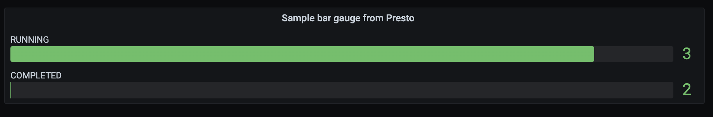
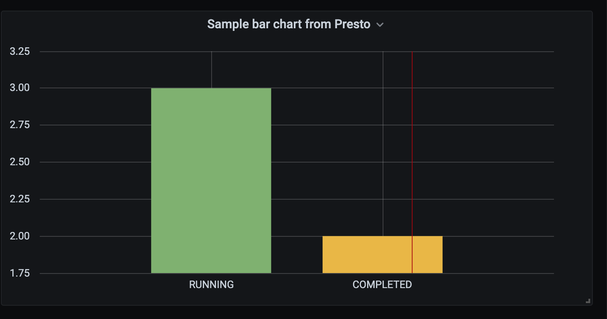

# Presto datasource for Grafana

## Features
This datasource allows Presto to be used as a datasource in Grafana. It is heavily and owes it to JamesOsGood's MongoDB datasource for Grafana. This was literally implemented and tested in 4 hours by modifying JamesOsGood's datasource source code. Also note that the code is pretty rudimentary right now and depends on a lot of ifs and buts. For timeseries queries, the time is auto-generated as currently my sole purpose is to use it for non-timeseries display in Grafana. This will be corrected soon.

## Requirements

* **Grafana** > 3.x.x
* **Presto** > 0.237 (tested, it will work for lesser versions as well)

## Installation

### Install the Grafana plugin components

* Copy the whole presto-grafana dir into the Grafana plugins dir ( /usr/local/var/lib/grafana/plugins )
* Restart the Grafana server. If installed via Homebrew, this will be `brew services restart grafana`

### Install and Start the Presto proxy server

* Open a command prompt in the presto-grafana directory
* Run `npm install` to install the node.js dependencies
* Run `npm run server` to start the REST API proxy to Presto. By default, the server listens on http://localhost:6666

## Examples

Create a new data source of type Presto as shown below. The Presto details are :

* **Presto URL** - Provide the host name for presto. For ex `presto`
* **Presto Catalog** - `kudu`
* **Presto Schema** - `default`

For Presto URL you shouldn't specify anything other than host name (no port, no http/https etc)
Note that port is hardcoded to 8080 right now. So anything entered in page is not used.

Then save the data source

#### Example 1 - Simple table

Query to use of the form: `select type, count(*) from users group by type`

Note that you shouldn't use ; for the query

#### Example 2 - Timeseries to plot non-timeseries data

Query to use: `select now() as time, status, count(*) as count1 from workflows group by status`

now() is to trick as a timeseries

Choose bar gauge visualization and you will see something like below

And you can switch to Graph panel for a bar chart

